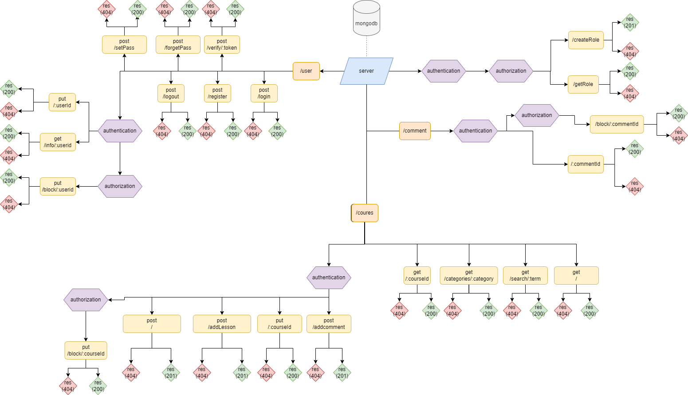

# server

## used library

- express
- cors
- morgan
- dotenv
- mongoose
- bcrypt
- jsonwebtoken

## Models

- user model

| key        | type            | options          | default value |
| ---------- | --------------- | ---------------- | ------------- |
| name       | String          | required, unique | n/a           |
| email      | String          | required, unique | n/a           |
| password   | String          | required         | n/a           |
| roles      | Schema <roles>  | required         | n/a           |
| isBocked   | Boolean         | n/a              | false         |
| headline   | String          | n/a              | n/a           |
| about      | String          | n/a              | n/a           |
| course     | Schema <course> | n/a              | n/a           |
| enrole     | Schema <course> | n/a              | n/a           |
| lessons    | Array           | n/a              | n/a           |
| isVerified | Boolean         | n/a              | false         |

- roles model

| key  | type   | options          | default value |
| ---- | ------ | ---------------- | ------------- |
| role | String | required, unique | n/a           |

- course model

| key         | type              | options  | default value |
| ----------- | ----------------- | -------- | ------------- |
| title       | String            | required | n/a           |
| about       | String            | required | n/a           |
| description | String            | required | n/a           |
| creator     | Schema <user>     | required | n/a           |
| category    | String            | required | n/a           |
| comments    | Schema <comment>  | n/a      | n/a           |
| reviews     | Schema <review>   | n/a      | n/a           |
| questions   | Schema <question> | n/a      | n/a           |
| isBocked    | Boolean           | n/a      | false         |

- comments model

| key         | type            | options  | default value |
| ----------- | --------------- | -------- | ------------- |
| creator     | Schema <user>   | required | n/a           |
| description | String          | required | n/a           |
| reference   | Schema <course> | required | n/a           |
| isBocked    | Boolean         | n/a      | false         |

- reviews model

| key         | type            | options  | default value |
| ----------- | --------------- | -------- | ------------- |
| creator     | Schema <user>   | required | n/a           |
| description | String          | required | n/a           |
| rating      | Number          | required | n/a           |
| reference   | Schema <course> | required | n/a           |
| isBocked    | Boolean         | n/a      | false         |

- questions model

| key         | type            | options  | default value |
| ----------- | --------------- | -------- | ------------- |
| creator     | Schema <user>   | required | n/a           |
| description | String          | required | n/a           |
| reference   | Schema <course> | required | n/a           |
| isBocked    | Boolean         | n/a      | false         |

- chate model

| key      | type             | options  | default value |
| -------- | ---------------- | -------- | ------------- |
| user1    | Schema <user>    | required | n/a           |
| user2    | Schema <user>    | required | n/a           |
| messages | array of objects | required | n/a           |

## Diagrams

### UML Diagrams

 

### ER Diagrams

 

## Links

### Trello

[Link to trello board](https://trello.com/mbprojectmohammedalmuziny)
